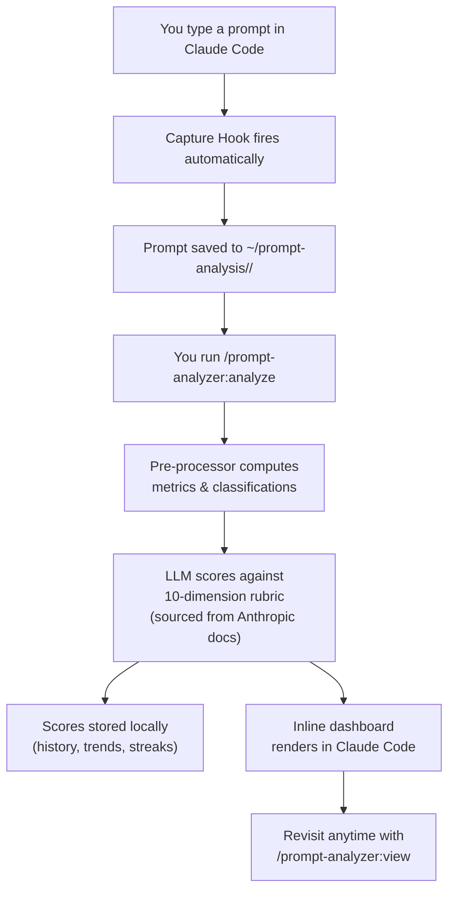

<h1 align="center">Claude Prompt Analyzer</h1>

<p align="center">
  
</p>

<p align="center">
  <strong>A Claude Code plugin that makes you measurably better at prompting — automatically.</strong>
</p>

<p align="center">
  
  
  
</p>

---

<p align="center">
  
</p>

## Features

Every feature is designed around one goal: **you should get better at prompting over time, with zero manual effort.**

**1. Every prompt you write is automatically tracked**
No opt-in, no setup per project. The moment you install the plugin, every prompt you type in Claude Code is silently logged.
> You finish a session and `/prompt-analyzer:analyze` already has 22 prompts to work with — across 3 projects.

**2. Deep quality feedback across 10 dimensions**
Clarity, specificity, context-giving, actionability, scope control, command usage, pattern efficiency, interaction style, friction avoidance, automation awareness.
> *"Specificity: 3.2/10 — your prompt `fix the bug` gives Claude nothing to go on. Try describing the symptom, the file, and the expected behavior."*

**3. Scores that compound over time**
Each report references the last. You see not just today's score but whether you acted on last week's feedback.
> *"Week 3 streak — composite up 1.1 points since Monday. You've nearly eliminated single-word prompts."*

**4. Inline dashboard — no browser required**
Score summary, dimension breakdown, trend sparklines, and prompt highlights render directly inside your Claude Code session.
> No opening a separate file. No waiting for a build. Everything in the chat window.

**5. One report across all your projects**
Working across 3 repos today? One `/prompt-analyzer:analyze` covers all of them — unified, with per-project breakdowns and cross-project patterns.
> *"You're more specific in `frontend` than `backend`. Your weakest project for context-giving: `infra-scripts`."*

**6. Detects your recurring patterns**
The system learns your prompt habits session over session. Recurring weaknesses get flagged until you fix them.
> *"You've sent 18 vague prompts this week. Pattern: starting tasks with a single verb — `refactor`, `test`, `document` — with no scope."*

**7. One install, self-configuring**
Two commands to install. The plugin configures itself on first session start — hooks, storage, everything.
> Start capturing from your next prompt forward. No YAML, no config files, nothing to edit.

**8. Your data is safe across version updates**
When a new version ships, your entire prompt history is automatically migrated. Backup is taken before migration; if anything fails, it rolls back — your history is never lost.
> Upgrade whenever you want. Zero data loss, zero manual steps.

**9. Stays private — never touches your repos**
All data lives in `~/prompt-analysis/` on your machine. It never enters any project directory, never gets committed, never leaves your device.
> Your prompts are yours.

**10. Quality standards sourced from Anthropic's own docs**
The scoring rubric is fetched from official Anthropic prompting guidelines at runtime — not hardcoded opinions — and refreshed every 15 days.
> Your scores are grounded in what Anthropic actually recommends, not someone's personal checklist.

---

<p align="center">
  
</p>

## Installation

> **Requires**: Claude Code (any version that supports plugins)

### Install

Run these two commands inside Claude Code:

```
/plugin marketplace add sahaarijit/claude-prompt-analyzer#main
```

```
/plugin install prompt-analyzer@sahaarijit-claude-prompt-analyzer
```

Then **restart Claude Code**. The plugin configures itself on the first new session — no further steps.

### Upgrade from v1.x

Run the same two install commands above. Your existing prompt history at `~/prompt-analysis/` is preserved and automatically migrated to the new format. Legacy files from the old manual install (in `~/.claude/`) are cleaned up automatically on first session.

> You do **not** need to manually delete anything.

### Uninstall

```
/plugin uninstall prompt-analyzer@sahaarijit-claude-prompt-analyzer
```

> Your data at `~/prompt-analysis/` is **not** deleted. Remove that folder manually if you want a clean slate.

---

<p align="center">
  
</p>

## How to Use

| Command | What it does |
|---|---|
| `/prompt-analyzer:analyze` | Analyze today's prompts across all projects; shows inline dashboard |
| `/prompt-analyzer:view` | Reopen the latest report without re-running analysis |
| `/prompt-analyzer:view trend` | Show 7-day composite score trend |
| `/prompt-analyzer:view 22-04-2026` | View the report for a specific date (`DD-MM-YYYY`) |

### Example: Running an analysis

```
/prompt-analyzer:analyze
```

```
Day: 22-04-2026 | Projects: 3 | Prompts: 18 | Composite: 7.1/10 ↑ (+0.6 vs yesterday) | Streak: 3 days

Dimensions
  Clarity         ████████░░  8.2     Specificity     ██████░░░░  6.1
  Context-giving  ████████░░  8.0     Actionability   ███████░░░  7.3
  Scope control   ███████░░░  7.1     Command usage   ████████░░  7.8
  Pattern eff.    ██████░░░░  6.4     Interaction     ████████░░  7.9
  Friction avoid  ███████░░░  7.2     Automation aw.  █████░░░░░  5.9

↑ Top improvement this week: context-giving (+1.4 pts)
⚠ Recurring gap: vague prompts — 4 today, 19 this week. Add scope + expected outcome.

Top prompt today (9.1/10):  "Refactor the auth middleware to use..."
Weakest today   (2.8/10):   "fix it"
```

### Example: Viewing past reports

```
/prompt-analyzer:view trend
```

```
7-day trend  Mon ▄ Tue ▅ Wed ▃ Thu ▆ Fri ▇ Sat ▄ Sun █
Composite:   6.1  6.4  5.9  6.8  7.0  6.3  7.1    ↑ +1.0 this week
```

---

<p align="center">
  
</p>

## How It Works



**Storage layout** (all local, all yours):

```
~/prompt-analysis/
  <your-project>/
    prompts/
      22-04-2026/
        prompts.md        ← your raw prompts
        metrics.json      ← pre-computed stats
  reports/
    22-04-2026/
      analysis.md         ← full written report
    state.json            ← scores, history, learned patterns
    rubric-cache.json     ← cached Anthropic rubric (15-day TTL)
```

---

<p align="center">
  
</p>

## Credits

- Jumping Claude mascot from [shanraisshan/claude-code-best-practice](https://github.com/shanraisshan/claude-code-best-practice) — a great reference for Claude Code patterns and conventions.
- Built with zero npm dependencies. Pure Node.js standard library.
