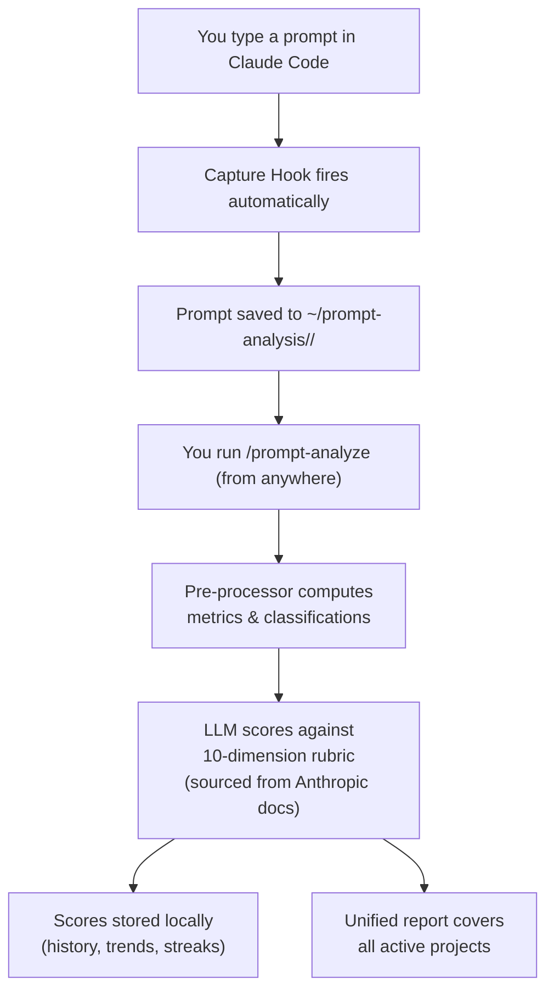

<h1 align="center">Claude Prompt Analyzer</h1>

<p align="center">
  
</p>

<p align="center">
  <strong>A Claude Code tool that makes you measurably better at prompting — automatically.</strong>
</p>

<p align="center">
  
  
  
</p>

> **Note:** This is the frozen v1.3 release branch. The latest version is [v2.0.0](https://github.com/sahaarijit/claude-prompt-analyzer).

---

<p align="center">
  
</p>

## Features

**1. Every prompt you write is automatically tracked**
Every prompt you type in Claude Code is silently logged, organized by project and day — all in `~/prompt-analysis/`, outside your repos.

**2. Deep quality feedback across 10 dimensions**
Clarity, specificity, context-giving, actionability, scope control, command usage, pattern efficiency, interaction style, friction avoidance, automation awareness.
> *"Specificity: 3.2/10 — `fix the bug` gives Claude nothing to go on."*

**3. One report for all your projects**
One `/prompt-analyze` covers all active projects — unified report with per-project breakdowns.

**4. Run from anywhere**
`/prompt-analyze` works regardless of which directory you're in. Scans all your tracked projects automatically.

**5. Scores that compound over time**
Track composite scores, streaks, milestones, and per-dimension trends day over day.

**6. Progressive reports**
Each report builds on the previous — checks whether you acted on last session's feedback.

**7. Safe version upgrades**
Data is automatically migrated on version updates. A backup is taken before each migration; on failure, original data is fully restored.

**8. Best-practice anchored scoring**
Quality rubric fetched live from official Anthropic prompting docs, cached locally for 15 days.

**9. Self-improving classification**
The system learns your prompt habits from LLM feedback over time.

**10. One-command setup**
A deploy script installs everything into `~/.claude/` in one step.

---

<p align="center">
  
</p>

## Installation

**Prerequisites:** Node.js >= 16, Claude Code

```bash
git clone https://github.com/sahaarijit/claude-prompt-analyzer.git
cd claude-prompt-analyzer
git checkout v1.3
node scripts/deploy.js
```

Then restart Claude Code.

### Upgrade from v1.x

```bash
git pull
node scripts/deploy.js
```

Your prompt history is preserved. Data is auto-migrated to the new format.

### Uninstall

```bash
rm ~/.claude/hooks/capture-prompts.js
rm -rf ~/.claude/skills/prompt-analyze/
```
Remove the hook entry from `~/.claude/settings.json` manually.

---

<p align="center">
  
</p>

## How to Use

| Command | What it does |
|---|---|
| `/prompt-analyze` | Analyze today's prompts across all projects; shows scored report |

---

<p align="center">
  
</p>

## How It Works



---

<p align="center">
  
</p>

## Credits

- Jumping Claude mascot from [shanraisshan/claude-code-best-practice](https://github.com/shanraisshan/claude-code-best-practice)
- Built with zero npm dependencies. Pure Node.js standard library.
