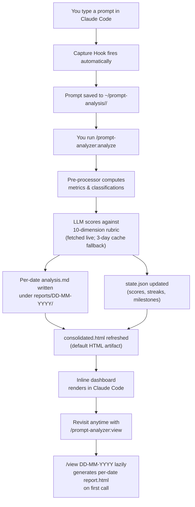

<h1 align="center">Claude Prompt Analyzer</h1>

<p align="center">
  
</p>

<p align="center">
  <strong>A Claude Code plugin that makes you measurably better at prompting.</strong>
</p>

<p align="center">
  
  
  
</p>

---

<p align="center">
  
</p>

## Features

- **Auto-capture** - Every prompt you type is silently logged. No setup, no opt-in per project.
- **10-dimension scoring** - Clarity, specificity, context-giving, actionability, scope, command usage, pattern efficiency, interaction style, friction avoidance, automation awareness.
- **Day-over-day progress** - Composite scores, streaks, and milestones tracked automatically.
- **Inline dashboard** - Score summary, dimension breakdown, and sparklines in the chat window. No browser needed.
- **Cross-project coverage** - One command covers all active projects with per-project breakdowns.
- **Pattern detection** - Recurring weaknesses flagged every session until they improve.
- **Zero-friction install** - Two commands. Self-configures on first session start.
- **Safe upgrades** - Data auto-migrated on version updates. Backup taken before; rollback on failure.
- **Private by default** - All data in `~/prompt-analysis/` on your machine. Never enters your repos.
- **Anchored to Anthropic's docs** - Scoring rubric sourced from official prompting guidelines; refreshed on every analyze run with a 3-day cache fallback.

---

<p align="center">
  
</p>

## Installation

> **Requires**: Claude Code (any version that supports plugins)

### Install

Run these three commands inside Claude Code:

```
/plugin marketplace add sahaarijit/claude-prompt-analyzer#main
```

```
/plugin install prompt-analyzer@prompt-analyzer-marketplace
```

```
/reload-plugins
```

The plugin configures itself on the first new session - no further steps. A full **Claude Code restart** gives the cleanest first-run experience but is optional once `/reload-plugins` has run.

### Upgrade from v1.x or v2.0.0

Run the same three commands above. Your existing data at `~/prompt-analysis/` is preserved and automatically migrated to the latest schema. Legacy files from the old manual install (in `~/.claude/`) are cleaned up automatically on first session.

> You do **not** need to manually delete anything.

### Uninstall

Check which scope the plugin is installed under:

```
/plugin
```

Then run the matching uninstall command.

**User-level install:**

```
/plugin uninstall prompt-analyzer@prompt-analyzer-marketplace --scope user
```

**Project-level install:**

```
/plugin uninstall prompt-analyzer@prompt-analyzer-marketplace
```

If neither command succeeds (most often because the identifier or scope does not match the registry), clean up manually:

1. Delete the cache: `rm -rf ~/.claude/plugins/cache/prompt-analyzer-marketplace`
2. Remove the entry keyed `prompt-analyzer@prompt-analyzer-marketplace` from `~/.claude/plugins/installed_plugins.json`
3. Remove `"prompt-analyzer@prompt-analyzer-marketplace": true` from `enabledPlugins` in `~/.claude/settings.json`
4. (Optional) Remove the `prompt-analyzer-marketplace` entry from `extraKnownMarketplaces` in `~/.claude/settings.json` and from `~/.claude/plugins/known_marketplaces.json`, plus the cached marketplace folder at `~/.claude/plugins/marketplaces/prompt-analyzer-marketplace/`

> Your data at `~/prompt-analysis/` is **not** deleted. Remove that folder manually if you want a clean slate.

---

<p align="center">
  
</p>

## How to Use

| Command | What it does |
|---|---|
| `/prompt-analyzer:analyze` | Analyze every unanalyzed date, oldest first. Writes per-date `analysis.md` + refreshes `reports/consolidated.html`. |
| `/prompt-analyzer:view` | Inline dashboard for the latest analyzed date + link to `consolidated.html`. |
| `/prompt-analyzer:view latest` | Same as above; explicit form. |
| `/prompt-analyzer:view today` | Inline dashboard for today (if analyzed). |
| `/prompt-analyzer:view yesterday` | Inline dashboard for yesterday. |
| `/prompt-analyzer:view trend` | 7-day composite trend table inline. |
| `/prompt-analyzer:view <DD-MM-YYYY>` | Inline dashboard for the specific date. First-time call for a date also lazily generates a per-date `report.html` for that date. |

> Consolidated HTML (`reports/consolidated.html`) is rewritten on every `analyze` run. Per-date HTML (`reports/{DD-MM-YYYY}/report.html`) is generated lazily the first time you view an explicit date, and reused after.

### Example: Running an analysis

```
/prompt-analyzer:analyze
```

```
Day: 22-04-2026 | Projects: 3 | Prompts: 18 | Composite: 7.1/10 ↑ (+0.6 vs yesterday) | Streak: 3 days

Dimensions
  Clarity         ████████░░  8.2     Specificity     ██████░░░░  6.1
  Context-giving  ████████░░  8.0     Actionability   ███████░░░  7.3
  Scope control   ███████░░░  7.1     Command usage   ████████░░  7.8
  Pattern eff.    ██████░░░░  6.4     Interaction     ████████░░  7.9
  Friction avoid  ███████░░░  7.2     Automation aw.  █████░░░░░  5.9

↑ Top improvement this week: context-giving (+1.4 pts)
⚠ Recurring gap: vague prompts - 4 today, 19 this week. Add scope + expected outcome.

Top prompt today (9.1/10):  "Refactor the auth middleware to use..."
Weakest today   (2.8/10):   "fix it"
```

### Example: Viewing past reports

```
/prompt-analyzer:view trend
```

```
7-day trend  Mon ▄ Tue ▅ Wed ▃ Thu ▆ Fri ▇ Sat ▄ Sun █
Composite:   6.1  6.4  5.9  6.8  7.0  6.3  7.1    ↑ +1.0 this week
```

---

<p align="center">
  
</p>

## How It Works



**Storage layout** (all local, all yours):

```
~/prompt-analysis/
  <your-project>/
    prompts/
      22-04-2026/
        prompts.md            ← your raw prompts
        metrics.json          ← pre-computed stats
  reports/
    consolidated.html         ← DEFAULT HTML; refreshed every analyze run
    state.json                ← scores, history, milestones, learned patterns
    rubric-cache.json         ← cached Anthropic rubric (3-day TTL)
    22-04-2026/
      analysis.md             ← per-date written report
      report.html             ← per-date HTML; generated LAZILY by /view DD-MM-YYYY
```

