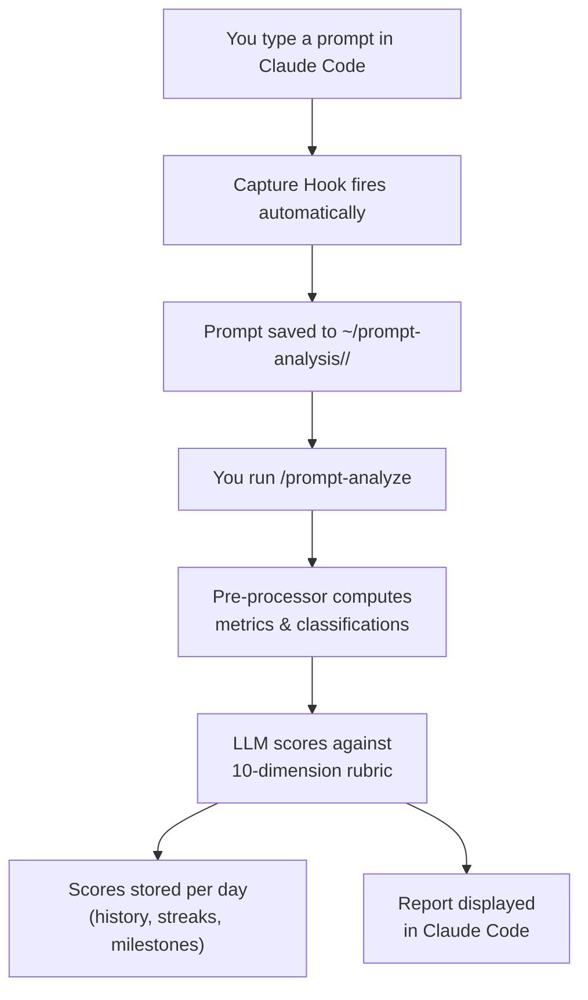

<h1 align="center">Claude Prompt Analyzer</h1>

<p align="center">
  
</p>

<p align="center">
  <strong>A Claude Code tool that makes you measurably better at prompting.</strong>
</p>

<p align="center">
  
  
  
</p>

> **Note:** This is the frozen v1.1 release branch. The latest version is [v2.0.0](https://github.com/sahaarijit/claude-prompt-analyzer).

---

<p align="center">
  
</p>

## Features

- **Auto-capture** — Every prompt you type is silently logged. No setup, no opt-in per project.
- **10-dimension scoring** — Clarity, specificity, context-giving, actionability, scope, command usage, pattern efficiency, interaction style, friction avoidance, automation awareness.
- **Day-over-day progress** — Composite scores, streaks, and milestones tracked automatically.
- **Centralized storage** — All data in `~/prompt-analysis/` — outside your repos, survives repo changes.
- **Self-improving classification** — Classification accuracy improves over time from LLM feedback.
- **One-command setup** — Deploy script installs everything in one step.

---

<p align="center">
  
</p>

## Installation

**Prerequisites:** Node.js >= 16, Claude Code

Clone the repository and run the deploy script:

```bash
git clone https://github.com/sahaarijit/claude-prompt-analyzer.git
cd claude-prompt-analyzer
git checkout v1.1
node scripts/deploy.js
```

Then restart Claude Code.

### Upgrade from v1.0

```bash
git pull
node scripts/deploy.js
```

The deploy script detects your current version and shows the version change (`1.0.0 → 1.1.0`).

### Uninstall

Delete the installed files from `~/.claude/`:
```bash
rm ~/.claude/hooks/capture-prompts.js
rm -rf ~/.claude/skills/prompt-analyze/
```
And remove the hook entry from `~/.claude/settings.json` manually.

---

<p align="center">
  
</p>

## How to Use

| Command | What it does |
|---|---|
| `/prompt-analyze` | Analyze today's prompts across all projects; shows scored report |

---

<p align="center">
  
</p>

## How It Works



